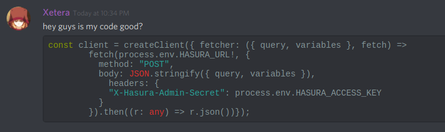
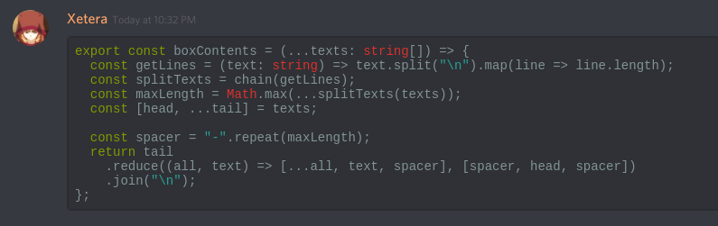

# js-clip-format

Format the javascript/typescript code in your clipboard. If you're asking for help online, the least you can do is make sure your code is pretty and easy to read.

When you copy paste code from an indented block in your text editor, that indentation carries out to other programs. That's pretty annoying.

Don't be this loser

Be **this** lad

### Required commandline tools

Make sure you have these memes installed before proceeding.

- xclip
- prettier

### Installation

Download `ftm.sh` and save it as a shortcut (I use ctrl + shift + 3)

### Usage

1. Copy bad code (or if you're like me, just any code you've ever written) into your clipboard
2. Run `ftm.sh`
3. Paste beautiful code
